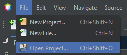
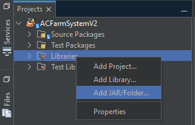
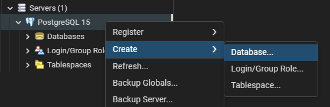
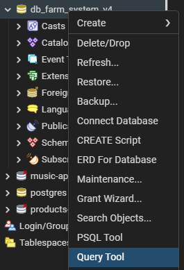
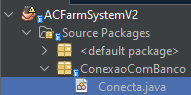
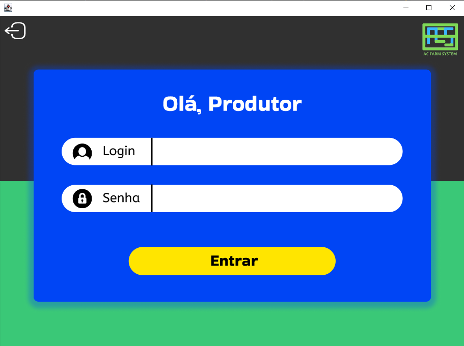
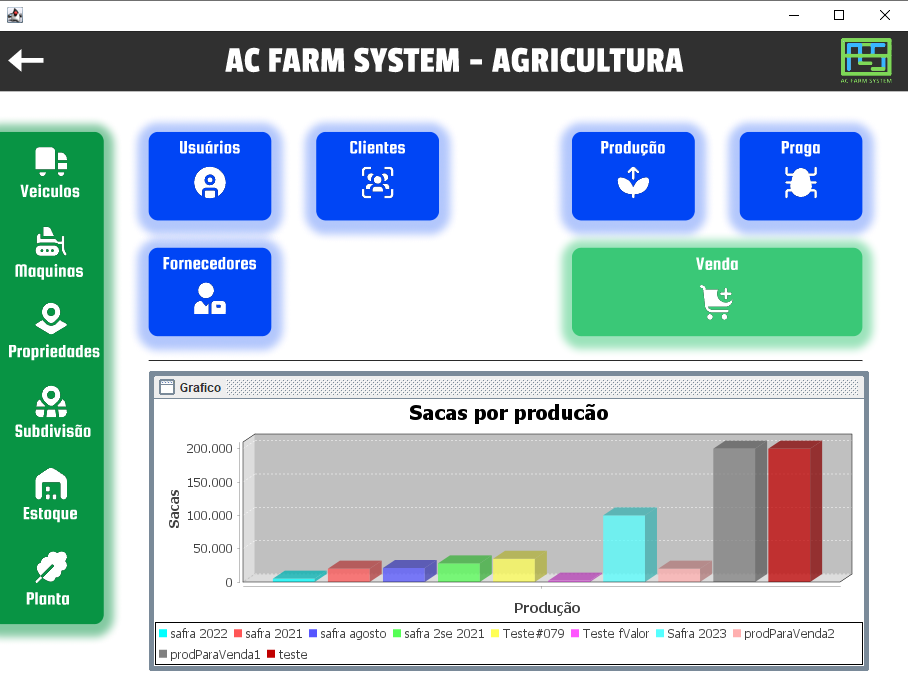

# AC FARM SYSTEM
### 🌱 Gestão e controle de fazendas
### 💡 Atividades e Funções
| Atividade | Funções |
| ------ | ------ |
| Veiculos | CRUD e Relatórios |
| Maquinas | CRUD e Relatórios |
| Propriedades | CRUD |
| Subdivisões | CRUD |
| Estoque | CRUD de todos os itens |
| Plantas | CRUD de todas as plantas |
| Usuários | CRUD |
| Clientes | CRUD |
| Fornecedores | CRUD e Relatórios |
| Produção | Cadastro, Verificação, Remoção e Relatórios |
| Pragas | CRUD |
| Vendas de Produções | Venda, Consulta e Relatórios |

### 👨‍💻 Tecnologias
- [Java] - Linguagem de programação
- [PostgresSQL] - Banco de dados PostgreSQL
- [Java Swing] - Framework

### ⛏️ Ferramentas
- [Netbeans IDEA] - IDEA principal
- [PgAdmin4] - Gestão do banco de dados
- [Figma] - Prototipação de Telas
- Astah - Criação de Diagramas
- [draw.io] - Criação de Diagramas
- [Git] - Controle e versionamento de projeto
- [GitHub] - Repositório

### ⚙️️ Como instalar e utilizar
Necessario: [Java], [Netbeans IDEA] e [PgAdmin4]

##### ⬇️ Download do projeto

1 - Fazer o download do projeto
```sh
git clone https://github.com/Gustavocorrea0/TCC-ADS-2024.git
```
2 - Extrair projeto <br>
3 - Iniciar [Netbeans IDEA], buscar projeto e abri-lo <br><br>
<br>

##### 📚 Adicionar biliotecas
1 - Caso após abrir o projeto ocorra algum erro nas biliotecas, se faz necessário realizar os imports das mesmas <br>
2 - Basta clicar "Libraries" no projeto e em seguida clicar com o botão direito <br><br>
<br>
3 - Após isso, clicar em "Add JAR/Folder..." <br>
4 - E buscar as necessarias bibliotecas na pasta clonada do git <br>
5 - As bibliotecas necessarias são: itextpdf-5.5.13.3, jasypt-1.9.3 e postgresql-42.6.0 

##### 🔩 Configurar Banco de dados
1 - Inicie o [PgAdmin4] <br>
2 - Selecione um servidor e crie um banco de dados com nome: db_farm_system <br><br>
<br>
3 - Após isso inicie uma "Query-tool" e cole o script do arquivo "bancoDeDados.sql" que está na pasta do repositorio clonado <br><br>
<br>
4 - Execute a criação do banco de dados <br>

##### ✅ Validar usuário e senha
1 - No [Netbeans IDEA], acessa o pacote "ConexaoComBanco" e abra o arquivo "Conecta.java" <br><br>
<br>
2 - Adicione o seu usuario do [PgAdmin4] no campo <seu-usuario> (padrão: postgres), na variavel: 
> private final String USUARIO = "<seu-usuario>";

3 - Adicione a sua senha do [PgAdmin4] no campo <sua-senha> (padrão: postgres), na variavel :
> private final String SENHA = "<sua-senha>";

4 - Após isso inicie o projeto <br><br>
<br>
#### 🚨 Possivéis Falhas
1 - Imports de bibliotecas <br>
2 - Usuário e Senha do [PgAdmin4] inválidos

### 🖥️ Telas


 


[Java]: <https://www.oracle.com/br/java/technologies/downloads/>
[PostgresSQL]: <https://www.pgadmin.org/>
[PgAdmin4]: <https://www.pgadmin.org/>
[Netbeans IDEA]: <https://netbeans.apache.org/front/main/index.html>
[Figma]: <https://www.figma.com/pt-br/>
[draw.io]: <https://app.diagrams.net/>
[Java Swing]: <https://netbeans.apache.org/front/main/index.html>
[Git]: <https://git-scm.com/>
[GitHub]: <https://github.com/>